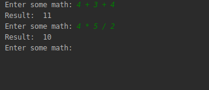

# Clojure Sample CLI Infix Calculator

Just a small CLI-based infix calculator that redos input to prefix for using Clojure's built-in operators.

More like a stub to see how a small CLI-based project could look.

## Prereqs

You need to have JDK, and Leiningen installed to be able to use this project.

To get your tools set up on an Ubuntu box, you can use my quick [guide](https://gist.github.com/christopherdoane/9b62f5c40ef08d6146b64b9da009ca32).

## Usage

- Import the folder / project into IntelliJ with Cursive installed. 
- -main is located in core.clj
- Input must be space-separated.
- Exit by crashing the program with any invalid input.

Example usage:

This doesn't handle parentheses, PEMDAS etc.

## License

Copyright © 2020 Christopher Doane

This program and the accompanying materials are made available under the
terms of the Eclipse Public License 2.0 which is available at
http://www.eclipse.org/legal/epl-2.0.

This Source Code may also be made available under the following Secondary
Licenses when the conditions for such availability set forth in the Eclipse
Public License, v. 2.0 are satisfied: GNU General Public License as published by
the Free Software Foundation, either version 2 of the License, or (at your
option) any later version, with the GNU Classpath Exception which is available
at https://www.gnu.org/software/classpath/license.html.
